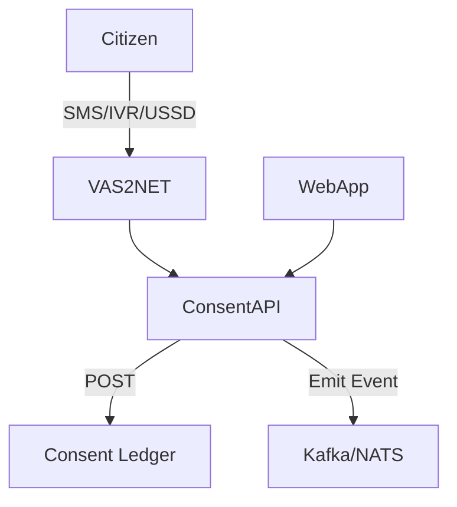

# 📜 Data Consent Infrastructure – DPI Middleware

## Overview

This module is part of the Digital Public Infrastructure (DPI) stack designed to support **data consent capture, verification, and enforcement**. It is aligned with privacy laws such as **NDPR**, **GDPR**, and supports scalable deployment in **African contexts, especially Nigeria**.

This will cover:

1. [Overview](#overview)
2. [Components](#-components)
   1. [OpenMined – PySyft (Consent Protocol)](#1-openmined--pysyft-consent-protocol)
   2. [VAS2NET – Voice IVR and SMS-based Consent](#vas2net-voice-ivr-and-sms-based-consent)
3. [Architecture Integration](#-architecture-integration)
4. [Cross-Language Support](#-cross-language-support)
5. [Security & Compliance Considerations](#-security--compliance-considerations)
6. [Indigenous Context for Nigeria](#-indigenous-context-for-nigeria)
7. [Sample Code Snippets](#sample-code-snippets)
8. [Deployment Considerations](#deployment-considerations)
9. [References](#-references)
10. [Contributors](#-contributors)

---

## 🔧 Components

### 1. OpenMined – PySyft (Consent Protocol)

- **Purpose**: Captures, encrypts, and manages consent records using federated models.
- **Integration**: Backend microservices, ML platforms, or standalone APIs.
- **Language Support**: Primarily Python; access via HTTP APIs for other stacks (Java, .NET, Go).

### VAS2NET – Voice IVR / SMS Gateway

- **Purpose**: Capture consent via **mobile phones** using USSD, IVR, or SMS (inclusive of rural demographics).
- **Integration**: Expose REST endpoints for integration with microservices or orchestration layers.
- **Indigenous Provider**: 🇳🇬 Built and operated in Nigeria, ideal for telco-integrated solutions.

---

## 🧩 Architecture Integration



---

## 🔐 Security & Compliance Considerations

- NDPR & GDPR alignment: Consent purpose, timestamp, revocation tracking
- Trace ID: Every consent entry is associated with a unique identifier for auditability
- Encryption: Consent payloads are encrypted using AES-256 (Fernet or PyCryptodome)
- Differential Privacy: Optional OpenDP integration for privacy-preserving insights

---

## 🌐 Cross-Language Support

| Language | OpenMined (via REST/Queue) | VAS2NET |
| -------- | -------------------------- | ------- |
| Python   | ✅ Native SDK              | ✅ REST |
| Java     | ✅ via REST / gRPC Gateway | ✅ REST |
| GoLang   | ✅ via REST / EventBus     | ✅ REST |
| .NET     | ✅ via REST or Service Bus | ✅ REST |

---

## 🇳🇬 Indigenous Context for Nigeria

- Use VAS2NET for nationwide USSD + SMS reach
- Add fallback for non-smartphone users via IVR
- Translate consent prompts into major languages (Yoruba, Hausa, Igbo)
- Apply NDPR clause mapping to data processing purpose fields

---

## Sample Code Snippets

### Python Consent Storage

```python
from syft.client.domain_client import DomainClient
client = DomainClient()
client.api.store({
  "user_id": "user123",
  "purpose": "health_data_usage",
  "granted": True,
  "timestamp": "2025-04-10T10:00:00Z"
})
```

### SMS Consent Handler

```python
from fastapi import FastAPI, Request
app = FastAPI()

@app.post("/sms-consent")
async def receive_sms(request: Request):
    payload = await request.json()
    if "CONSENT YES" in payload["message"]:
        # Store consent to PySyft
        ...
```

---

## 📦 Deployment Considerations

- Host Consent APIs behind a secure gateway (e.g. Kong, NGINX)
- Use TLS 1.3 for all inbound/outbound traffic
- Deploy SMS & Voice listeners in high-availability clusters
- Optionally back data to a distributed ledger (e.g., Hyperledger Fabric)

---

## 📚 References

- [OpenMined Docs](https://docs.openmined.org/)
- [VAS2NET Developer Docs](https://vas2net.com)
- [NDPR Framework (Nigeria)](https://nitda.gov.ng)
- [OpenDP](https://opendp.org)

---

## 🤝 Contributors

This module was curated by solution architects working on DPI implementations across Nigeria.
