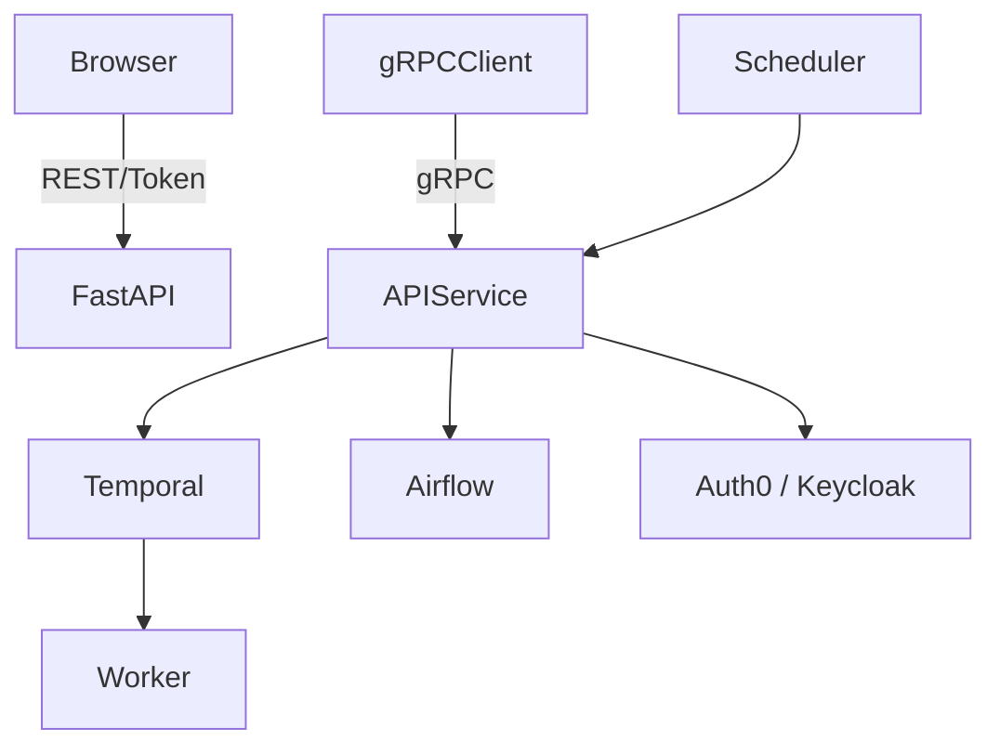

# 🚀 Microservice Delivery – DPI Middleware

## Overview

This stack provides the core service orchestration, execution, and communication layer for building Digital Public Infrastructure (DPI) platforms. It supports stateless APIs, long-running workflows, secure service communication, and scalable authentication systems.

---

## Table of Contents

1. [Core Components](#-core-components)
2. [Architecture Diagram](#-architecture-diagram)
3. [Setup Guide](#-setup-guide)
   1. [APIs with FastAPI + gRPC](#1-apis-with-fastapi--grpc)
   2. [Workflow Engines](#2-workflow-engines)
   3. [Scheduling with Apache Airflow](#3-scheduling-with-apache-airflow)
   4. [Authentication (OAuth2.0)](#4-authentication-oauth20)
4. [Cross-Language Integration](#-cross-language-integration)
5. [Security Best Practices](#-security-best-practices)
6. [Nigeria DPI Considerations](#-nigeria-dpi-considerations)
7. [References](#-references)
8. [Contributors](#-contributors)

---

## 🧩 Core Components

| Component       | Recommended Tools           | Purpose |
|-----------------|-----------------------------|---------|
| APIs           | FastAPI + gRPC              | High-performance, language-neutral communication |
| Workflows      | Temporal.io / Prefect       | Resilient, distributed stateful orchestration |
| Scheduling     | Apache Airflow              | Timed pipelines for ETL, policy enforcement, cleanup |
| Authentication | Auth0 / Keycloak            | Identity and access management (OAuth2, OIDC, RBAC) |

---

## ⚙️ Architecture Diagram



---

## 🚀 Setup Guide

### 1. APIs with FastAPI + gRPC

**Install Python APIs**

```bash
pip install fastapi[all] grpcio grpcio-tools uvicorn
```

**Example:**

```python
from fastapi import FastAPI

app = FastAPI()

@app.get("/ping")
def ping():
    return {"status": "alive"}
```

**gRPC Protos**

```proto
syntax = "proto3";

service HealthCheck {
  rpc Ping (Empty) returns (Pong);
}
```

**Compile with:**

```bash
python -m grpc_tools.protoc -I. --python_out=. --grpc_python_out=. service.proto
```

---

### 2. Workflow Engines

**Temporal.io**

```bash
chmod +x install_temporal.sh
./install_temporal.sh
```

**Run Worker**

```python
pip install temporalio

@workflow.defn
class DataConsentWorkflow:
    @workflow.run
    async def run(self, user_id: str):
        await activity.send_consent_sms(user_id)
```

**Prefect**

```bash
pip install prefect
prefect server start
```

---

### 3. Scheduling with Apache Airflow

**Installation**

```bash
pip install apache-airflow
airflow db init
airflow webserver -p 8080
airflow scheduler
```

**DAG Example**

```python
from airflow import DAG
from airflow.operators.python import PythonOperator

with DAG("check_consent", schedule_interval="@daily") as dag:
    task = PythonOperator(
        task_id="consent_check",
        python_callable=check_consent_function
    )
```

---

### 4. Authentication (OAuth2.0)

**Auth0/Keycloak Setup**

```bash
# Keycloak
docker run -p 8080:8080 quay.io/keycloak/keycloak start-dev
```

**FastAPI Integration**

```python
from fastapi.security import OAuth2PasswordBearer

oauth2_scheme = OAuth2PasswordBearer(tokenUrl="token")

@app.get("/secure")
def read_secure(token: str = Depends(oauth2_scheme)):
    user = decode_token(token)
```

---

## 🌐 Cross-Language Integration

| Feature        | Java            | GoLang          | .NET            |
|----------------|-----------------|-----------------|-----------------|
| API Client     | ✅ REST/gRPC    | ✅ gRPC         | ✅ gRPC         |
| Auth0 SDK      | ✅ Yes          | ✅ Yes          | ✅ Yes          |
| Temporal SDK   | ✅ Beta         | ✅ Stable       | ⚠️ Community    |
| Airflow DAGs   | ⛔ Python-only  | ⛔ Python-only  | ⛔ Python-only  |

---

## 🛡 Security Best Practices

- Enforce JWT validation in API Gateway or middleware
- TLS everywhere (REST + gRPC)
- Store secrets in Vault or KMS
- Rotate OAuth client secrets frequently
- Avoid long-lived tokens

---

## 🇳🇬 Nigeria DPI Considerations

- Support offline flows: emit retryable jobs for unstable connectivity
- Integrate SMS/USSD triggers in DAGs or Workers
- Use localized claims in JWT ("zone": "NG-LAGOS")
- Emit audit logs to local Data Lake or ELK stack

---

## 📚 References

- [FastAPI Documentation](https://fastapi.tiangolo.com)
- [gRPC Official Site](https://grpc.io)
- [Temporal.io Docs](https://docs.temporal.io)
- [Apache Airflow Docs](https://airflow.apache.org)
- [Auth0 Documentation](https://auth0.com/docs)
- [Keycloak Documentation](https://www.keycloak.org/documentation)

---

## 🤝 Contributors

This module is part of DPI middleware architecture designed for scalable, sector-neutral deployments in Africa and beyond.
